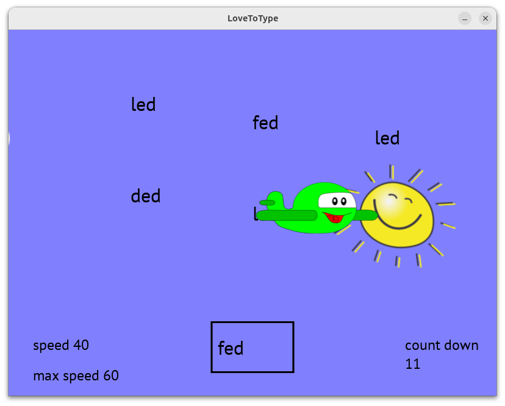

# Love To Type

A touch typing tutor written in Lua using the LÖVE 2D API. 

Love To Type is based on the TI-99/4a Touch Typing Tutor program from the early 1980s. This is the program from which I learned touch typing. I've been looking for touch typing software for my children but have not found anything I like as well.


## Features

### Structured Lessons
Each lesson is carefully designed to introduce 4-5 new keys at a time:
- First, you'll type nonsense combinations to get familiar with new keys
- Next, individual keys appear one at a time in a box for practice
- Then, you'll type words or combinations using the newly learned keys
- At the end, your actual and target words per minute are displayed

### Engaging Game Mode
- An airplane flies by and leaves words in the sky
- Type any visible word and press RETURN or SPACEBAR
- Correctly typed words transform into suns
- The faster you type, the faster the plane will go
- Challenge yourself to reach the maximum speed
- Each game has a 3-minute time limit

## Desktop Version

### Installation

The latest version of LoveToType works with LÖVE 11.5. LÖVE can be downloaded for Mac, Linux, and Windows from [love2d.org](https://love2d.org/).

Once LÖVE is installed, you can:

1. Download the latest `LoveToType.love` file from the [releases page](https://github.com/bblodget/LoveToType/releases)
2. Simply double-click the downloaded file to run it
3. Alternatively, run it from the command line: `love LoveToType.love`

### Building from Source

If you want to build from source:

```bash
git clone https://github.com/bblodget/LoveToType.git
cd LoveToType
make love
```

To run the desktop version directly from source:

```bash
make run-desktop
```

## Web Version

You can play the web version directly in your browser at:
[https://bblodget.itch.io/lovetotype](https://bblodget.itch.io/lovetotype)

### Browser Requirements

The web version requires a modern browser with WebAssembly and SharedArrayBuffer support. If you encounter issues, try using the latest version of Chrome, Firefox, or Edge.

### Running Locally

If you want to run the web version locally:

1. Clone this repository:
   ```
   git clone https://github.com/bblodget/LoveToType.git
   cd LoveToType
   ```

2. Run the web server using Make:
   ```
   make run-web
   ```

   This will build the .love file, set up the web distribution, and start the Node.js server.

3. Open your browser and navigate to:
   ```
   http://localhost:8000
   ```

### Makefile Options

The project includes a Makefile with several useful targets:

```
make help
```

Output:
```
LoveToType Makefile

Targets:
  all         - Build .love file and set up web distribution (default)
  love        - Build just the .love file
  web         - Set up web distribution
  run-web     - Start web server at http://localhost:8000
  run-desktop - Run desktop version with LÖVE
  clean       - Remove build artifacts (.love files)
  help        - Show this help message
```

## How to Play

### Lesson Mode
Select a level and then a lesson to begin. Each lesson teaches you new keys through a structured approach:
1. Practice nonsense combinations to introduce each new key (type each line twice)
2. Type individual keys as they appear in the box
3. Practice words using the new keys (type each line twice)
4. Review your performance at the end

You can exit any lesson at any time by pressing the Escape key.

### Game Mode



- The airplane flies across the screen, leaving words in its wake
- Type any of the words you see and press ENTER or SPACEBAR
- When you correctly type a word, it transforms into a sun
- The faster you type, the faster the airplane will go
- Your current speed and maximum speed are displayed at the bottom
- Each game has a 3-minute time limit

## Controls

- **Typing**: Type the displayed words/characters
- **Space/Enter**: Submit your typed word
- **Escape**: Return to menu
- **Mouse**: Click on buttons for menu navigation

## License

This program is free software: you can redistribute it and/or modify it under the terms of the GNU General Public License as published by the Free Software Foundation, either version 3 of the License, or (at your option) any later version.

This program is distributed in the hope that it will be useful, but WITHOUT ANY WARRANTY; without even the implied warranty of MERCHANTABILITY or FITNESS FOR A PARTICULAR PURPOSE. See the GNU General Public License for more details.

You should have received a copy of the GNU General Public License along with this program. If not, see [http://www.gnu.org/licenses/](http://www.gnu.org/licenses/)

## Credits

- Original program by Brandon Blodget
- Web version uses love.js by [2dengine](https://github.com/2dengine/love.js) 